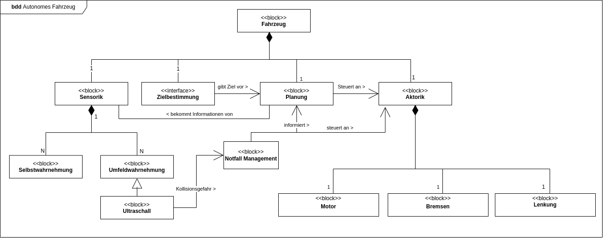

# BDD autonomes Fahrzeug

In dem Diagramm wurde der **Ultraschall Sensor** als eine Instanz der **Umfeldwahrnehmung** ergänzt.\
Dieser kommuniziert direkt mit dem **Notfall Management**.\
Die **Notfall Management** Komponente wurde eingeführt um die **Planung** zu umgehen und direkt die **Aktorik** anzusteuern,
Damit im Notfall schneller reagiert werden kann. \
Im Falle einer Notbremsung wird die **Planung** informiert, damit diese nicht probiert die **Aktorik** wieder zu überschreiben.\
Die **Aktorik** ist dann dafür verantwortlich die Notfallbremsung durchzuführen.
